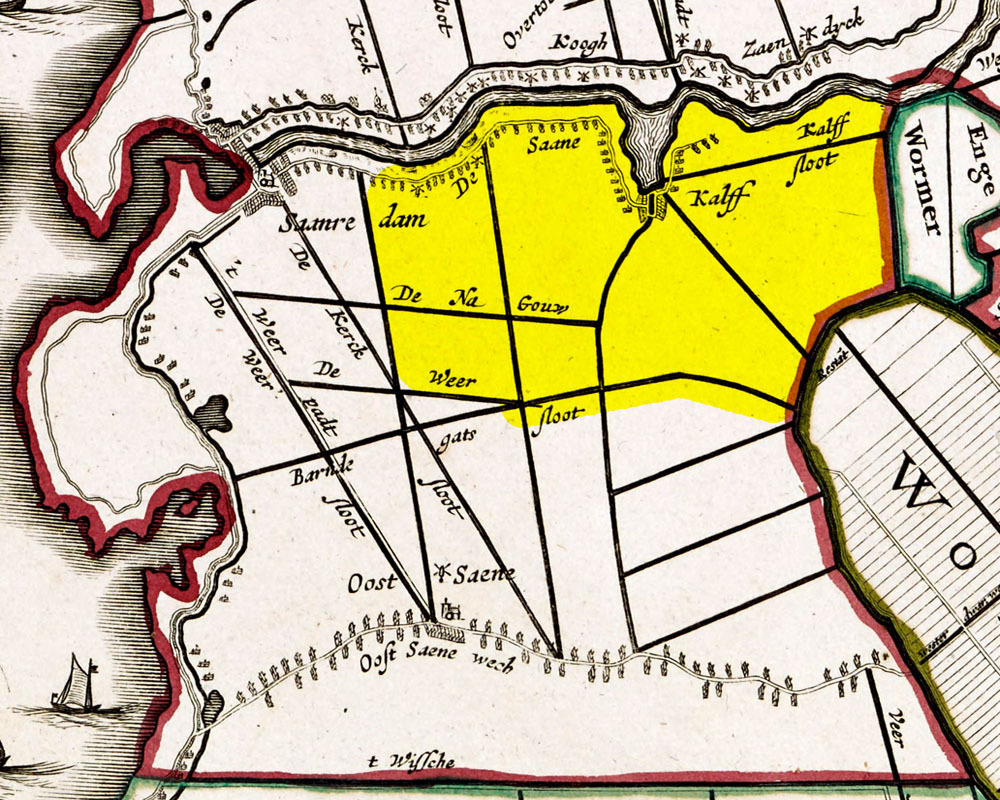
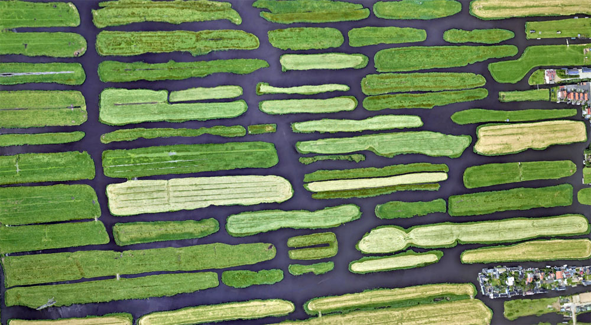
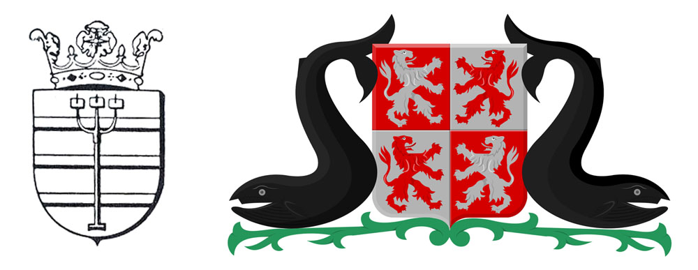
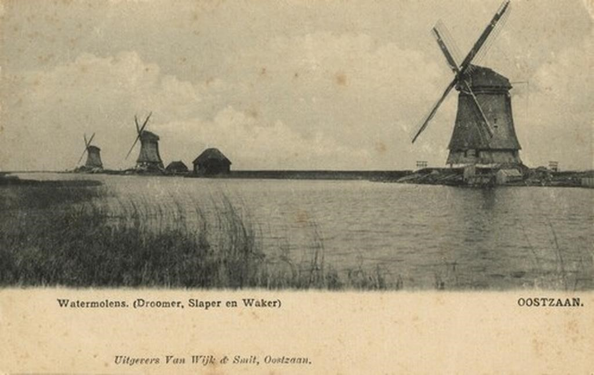
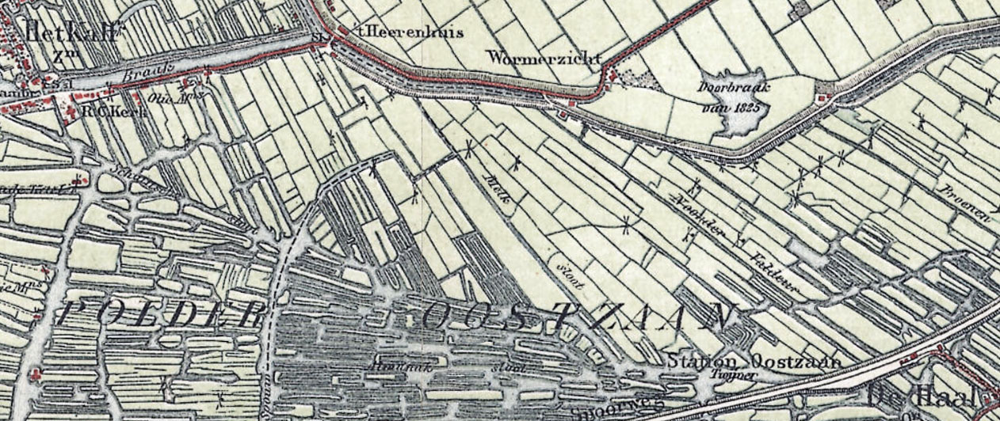
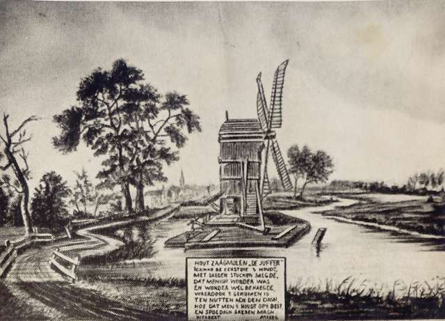
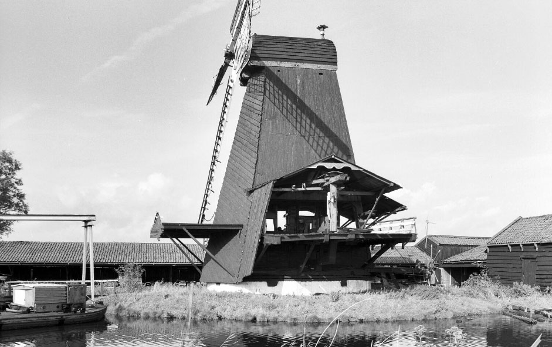
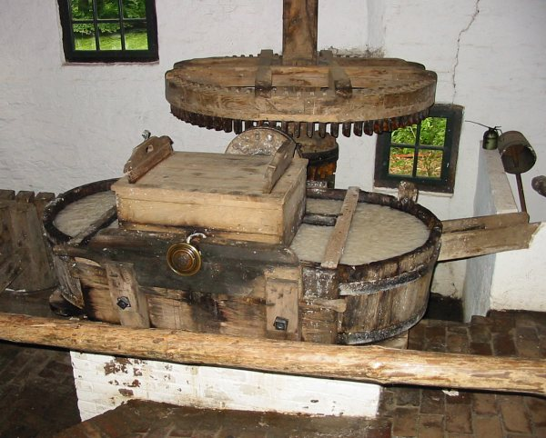

# Vragen, vragen, vragen
## Welke polder gaan we bewandelen?

De polder die we gaan bewandelen heet _Polder Oostzaan_, administratief ook wel bekend als de _Banne Oostzaan_.

Omstreeks 1750 publiceerde een Fransman die er nog nooit was geweest onderstaande kaart van de polder -- een verraderlijk landschap van riet, poelen en drijvend veen dat in de middeleeuwen min of meer bewoonbaar was gemaakt door er ontwateringssloten doorheen te graven. Op het kaartje staan alleen de belangrijkste sloten weergegeven en dan ook nog eens als kaarsrechte lijnen van constante dikte. Allemaal fantasie. De werkelijkheid is rommeliger.

> De Polder Oostzaan op de kaart van de Fransman. Omvang is ongeveer 2500 hectare (5 bij 5 kilometer). Het wandelgebied heb ik geel gemarkeerd. Het omvat ook de Kalverpolder.

> De Polder Oostzaan in werkelijkheid (fragment).

De Polder Oostzaan lag aan de noordelijke rand van de beschaafde wereld. De Graven van Holland hadden hier nog nét iets te zeggen. Ze hieven tol als je vanuit het Amstelland Het IJ over voer naar de Oostzaander Overtoom. Wat er daarna met je gebeurde, daar hadden de autoriteiten weinig zicht op.

Linksonder op de kaart zien we een bootje arriveren bij de Overtoom, waar in de walvistijd (±1650) de traankokerijen stonden te stinken. Een moeilijk begaanbare weg voerde diep het veen in. Alleen als het voldoende had gevroren mocht men er met paard en wagen overheen. Men leefde door de eeuwen heen van het boerenbedrijf en turfwinning (zie het wapen van Oostzaan) maar ook van walvisvaart (zie het wapen van Zaanstad).

Het deel van Oostzaan dat zich nabij de dam in de Zaan bevond, werd Oostzaandam genoemd. Op de andere oever van de Zaan speelde zich iets vergelijkbaars af. Daar had je Westzaan en Westzaandam. In 1811 ging dhr. Napoleon Bonaparte over tot de stichting van _Zaandam_. Hij deed dat door Oostzaandam en Westzaandam samen te voegen. 

>Links het wapen van Oostzaan. Een greep (landbouwattribuut) spietst drie objecten. Mij is op mijn Oostzaanse lagere school geleerd dat het drie veenplaggen zijn. In werkelijkheid is het als met de meeste dingen: men weet het eigenlijk niet. Het wapen van Oostzaan is eeuwenoud.
>
> Het wapen van de Gemeente Zaanstad (rechts) wordt geflankeerd door twee blije walvissen. Dit weten we wél want Zaanstad en zijn wapen zijn nog erg jong. In 1974 werd Zaanstad gevormd door samenvoeging van Zaandam met nog zes gemeentes. Die liggen allemaal op de westelijke Zaanoever en zijn voor ons verhaal dus van geen belang, net als de vier leeuwen. Ten oosten van de Zaan heb je geen leeuwen.

De grenzen van de polder zijn:

Aan de oostkant (op de kaart: onder) het riviertje _het Twiske_, of _de Twisk_, of _'t Wissche_, thans middelpunt van recreatiegebied _Het Twiske_. (Voorbij het Twiske ligt _Waterland_.)

In het noorden (rechts) vooral veel grote waterplassen (Wormer, Purmer, Beemster, Schermer) die pas in de zeventiende eeuw werden drooggelegd. (Voorbij die plassen ligt _West-Friesland_.)

Boven, in het westen, zien we de rivier de Zaan, stromend (als de sluis open stond) vanuit West-Friesland (rechts) naar (links) Het IJ. Bewesten de Zaan ligt, voorbij Westzaan, het _Kennemerland_.

## Waar stond het gemaal?

Belangrijke vraag.

Halverwege Oostzaan en Zaandam, waar de Barndegatssloot het IJ ontmoet was een sluis. Aan het begin van de zeventiende eeuw werden daar drie molens gebouwd om het zinkende landschap nog fanatieker te ontwateren. Begin twintigste eeuw werden de molens vervangen door een dieselgemaal.

> De drie Barndegattermolens.

Langs de Barndegatssloot loopt tegenwoordig de A8 ('Coentunnelweg'). Die verdeelt de polder in een landelijk deel (_Oostzanerveld_) aan de oostkant en een stedelijk deel (_Zaandam_) aan de westkant.

Wat op het kaartje nog Het IJ is, is tegenwoordig ook ingepolderd en verstedelijkt onder de noemer _Amsterdam-Noord_.

## Waar woonde ik?

Ik groeide op in het landelijke deel van de polder, in het noorden van het dorp Oostzaan in de buurtschap De Haal, binnen het verzorgingsgebied van de Noorderschool, met uitzicht op de Wijdewormer, die op het kaartje van de Fransman herkenbaar is aan de letters _Wo_.

## Waar begint de wandeling?

Bij de zuidwestelijke punt van de Wijdewormer heeft de Fransman _restat_ geschreven. Is dat Frans voor 'hier kan men verblijven'? Ik weet het niet maar er bevindt zich daar al eeuwen een pleisterplaats die tegenwoordig _Het Heerenhuis_ heet. Daar spreken we af.

Café Brasserie Het Heerenhuis  
Zuiderweg 74  
Wijdewormer  
https://www.heerenhuis.nl/

> Op deze kaart uit plusminus 1900 heet _Het Heerenhuis_ ook al _'t Heerenhuis_. Oostzaan had in de buurtschap De Haal een goederenstation (rechtsonder), dat in de jaren 30 verdween. 50 jaar later woonde ik in een doodlopende straat  met nog steeds de indrukwekkende naam _Stationsstraat_.

## Moeten we ver?

We gaan een rondje van 15,8 kilometer lopen, onderverdeeld in drie etappes, onderbroken door horecamomenten. Alle gezichten van de Polder Oostzaan komen aan bod, van het industrieel erfgoed langs de Zaan tot het natuurschoon van het Oostzanerveld. We doen ook de Kalverpolder aan, met zijn wereldberoemde schans.

Helaas ontkomen we er niet aan om ook een half uurtje door de inspiratieloze buitenwijken van Zaandam te wandelen; we moeten nu eenmaal het rondje compleet maken. Op dat deel van het traject komen we wél het gebouw tegen waar ik mijn middelbareschoolopleiding volgde (het Blaise Pascalcollege), inclusief het park waar we in de pauzes rondhingen. Mijn woonadres uit de jaren zeventig en tachtig gaan we zien vanuit de verte, als we op het viaduct over de spoorlijn Zaandam-Hoorn uitzien over het Oostzanerveld.

# Historie

## De Industriële Revolutie

De Industriële Revolutie begon in december 1592 toen molenaar Cornelis Corneliszoon in Uitgeest (Kennemerland) de houtzaagmolen uitvond. In het bijzonder verwierf hij het patent op een krukas die sterk genoeg was om de enorme kracht van een windmolen te verwerken.

In 1594 verscheen zijn eerste houtzaagmolen (een op het water drijvend model genaamd _Het Juffertje_) nabij de dam in de Zaan. Waarom aldaar? Omdat er bij die dam geen stad was. Je had er alleen de buurtschappen Oostzaandam en Westzaandam. In de steden had je gildes. Houtzagersgildes bijvoorbeeld. Die beschermden de werkgelegenheid van de met-de-handzagers en hielden dus de komst van windaangedreven zaagmachines tegen. Aan de Zaan was _wel_ gelegenheid voor ongebreidelde mechanisatie. Met een houtzaagmolen produceerden de Zaankanters hun planken tien keer zo snel, met grotere precisie en voor een fractie van de prijs. Er verrezen er binnen de kortste keren een paar honderd langs de Zaan, dat zich om die reden het oudste industriegebied van Europa noemt.

> Kunstenaarsindruk van houtzaagmolen _De Juffer_, drijvende op het water. Hier nog in Uitgeest waar uitvinder Cornelis Corneliszoon het beroep van molenaar uitoefende. Bij draaiende wind werd het gehele vlot waarop de molen stond naar de juiste kant gedraaid.

De molens waren al snel geen drijvende exemplaren meer, maar grotere constructies op de wal die naar de wind werden gericht met gietijzeren rollers op een gemetselde onderring. Het silhouet van zo'n molen leek veel op een immigrant uit Rijnland-Pfalz met zijn typische wijdvallende Rijnland-Pfalzer mantel. Vandaar de naam: paltrokmolen.

> Is het een bezoeker uit Rijnland-Pfalz die ik daar zie? Nee. Het is balkenzager _De Held Jozua_ in Zaandam, met zijn karakteristieke open werkvloer. Een van de vijf nog resterende paltrokmolens in Nederland.

Behalve voor het zagen van hout was de krukas van Cornelis Corneliszoon ook geschikt om grote oliemolens te ontwikkelen. Die stampten lijn- en raapzaad om beschermende olie en verf te produceren voor de scheepsbouw, die in Zaandam inmiddels ook floreerde. Samen met de precies op maat gezaagde scheepsonderdelen uit de houtzaagmolens was het mogelijk om middels een lopendebandlogistiek veel sneller schepen te produceren. De unieke _Groenlandvaarder_ bijvoorbeeld -- een ijsbreker die aan de basis stond van een volgend tijdperk in de Zaanse geschiedenis: de walvisvaart.

Door technische vernieuwing werden molens ook geschikt gemaakt voor het produceren van hoogwaardig papier, het kloppen van hennep, en de productie van levensmiddelen (rijst pellen, cacao verpoederen, mosterd malen). Dit leidde, toen de stoomrevolutie de windrevolutie overvleugelde, tot de fabrieken van Duyvis, Lassie, Verkade en Honig, tot de Zaanse mosterd en tot de Zaanse mayonaise-in-een-tube. De Oostzaander kruidenier Albert Heijn ging hier ook al snel zijn eigen levensmiddelen produceren en de Zaanse cacaoverwerkende industrie groeide uit tot de grootste ter wereld.

> De [_hollander_](https://commons.wikimedia.org/wiki/File:Hollander.jpg). Een maalbak voor papierpulp die een revolutie teweegbracht in de papierproductie, ontwikkeld volgens de Zaanse sneller-beter-goedkopermethode. De eerste kopieën van de Amerikaanse Onafhankelijkheidsverklaring werden gepubliceerd op het superieur geachte Zaanse papier.